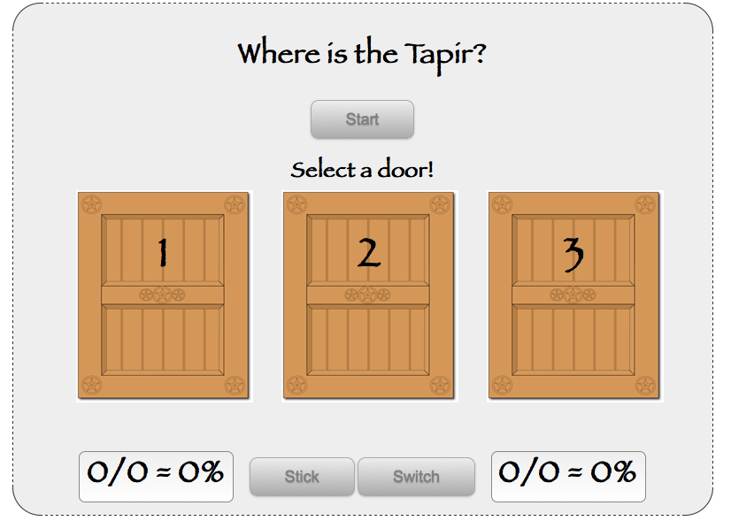

!SLIDE jquery
# enableDoors
## addClass, removeClass, hover, bind

    @@@ Javascript
    function enableDoors() {
      info("Select a door!");
      $('#doors li')
        .addClass('enabled')
        .hover(
          function() {$(this).addClass('hover')},
          function() {$(this).removeClass('hover')})
        .bind('click', doorSelected);
    }

!SLIDE center transition=scrollUp

!SLIDE jquery
# doorSelected
## data, unbind, mouseenter, mouseleave

    @@@ Javascript
    function doorSelected(e) {
      ...
      var door = $(this).data('id');
      $('#doors li')
        .unbind('click mouseenter mouseleave')
      putSelected(door);
    }

!SLIDE jquery
# putSelected
## PUT, currentToken

    @@@ Javascript
    function putSelected(door) {
      $.ajax({
        type: 'PUT',
        url: '/quiz/' + currentToken
                  + '/select/' + door,
        success: function(data) { ... }
      });
    }

