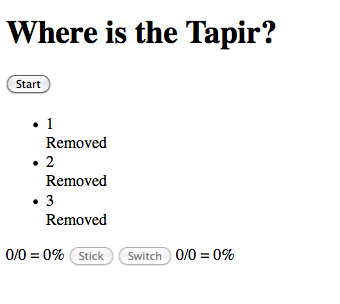
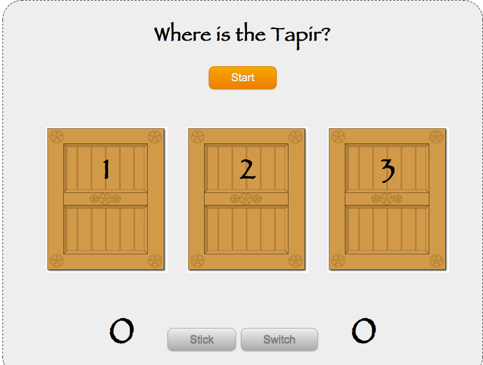

!SLIDE
# jQuery & Sinatra
## A Classy Combination
### anders.janmyr@jayway.com
### http://anders.janmyr.com
### @andersjanmyr
.notes Old man, short attention span, No time to wait for Maven, Dynamic languages, fast feedback

!SLIDE center

.notes A priest fell into a well, but managed to grab hold of a small
root an the way down. He started to scream, "Hello, is there anybody up
there?". Nothing happened! He screamed again "Hello, is there anybody up
there?", Suddenly a sound of thunder came from the clouds above the
well. "This is your God speaking, let go of the root and I will save
you!" A brief silence then the priest screamed, "Is there anybody else
up there?" 

.notes Whether you like Javascript or not does not have
anything to do with rational thinking, it is a lot closer to religion
than that. My point with this presentation is to show you why I love
Javascript, with the hope, that you will come to love it too.

!SLIDE jquery
# jQuery
## Write less, do more

!SLIDE sinatra
# Sinatra
## The classy web framework

!SLIDE center

!SLIDE center transition=scrollUp

!SLIDE bullets
# What do you Choose?

* 1 - The odds are better if I stick!
* 2 - The odds are better if I switch!
* 3 - The odds are the same!

