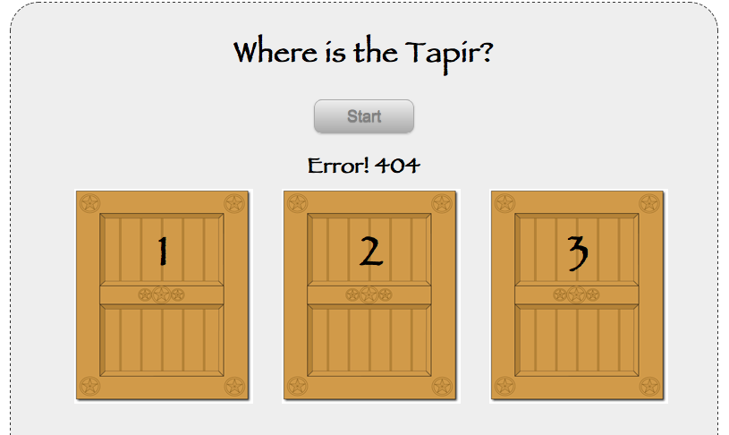

!SLIDE jquery
# Ajax
## Asynchronous Http Request

    @@@ Javascript
    $.ajax({
      type: 'POST',
      url: '/quiz',
      dataType: 'text',
      success: function(data) { ... },
      error: function(xhr, status, error) {
        info('Error! ' +
          ( error ? error : xhr.status ));
      }
    });

!SLIDE jquery bullets
# Ajax Shortcuts

* $.get()
* $.post()
* $.load()
* $.getJSON()
* $.getScript()

!SLIDE jquery
# Post

    @@@ Javascript
    $.post('/quiz',
      function(data) { ... }, 'text');
    // No error handling

!SLIDE center transition=scrollDown
