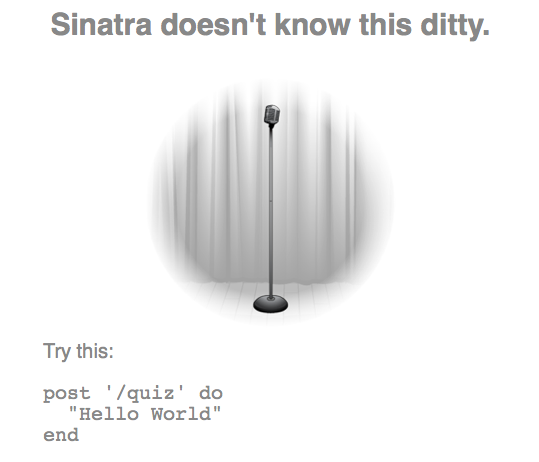

!SLIDE center

!SLIDE sinatra code
# post /quiz

    @@@ Ruby
    post "/quiz" do
    end

!SLIDE bullets sinatra
# Routes, HTTP Verbs

    @@@ Ruby
    get     # GET
    post    # POST
    put     # PUT
    delete  # DELETE

!SLIDE sinatra code
# /quiz implementation

    @@@ Ruby
    post "/quiz" do
      Quiz.new.quiz_id.to_s
    end

!SLIDE sinatra
# / redirect

    @@@ Ruby
    get "/" do
      redirect '/index.html'
    end
