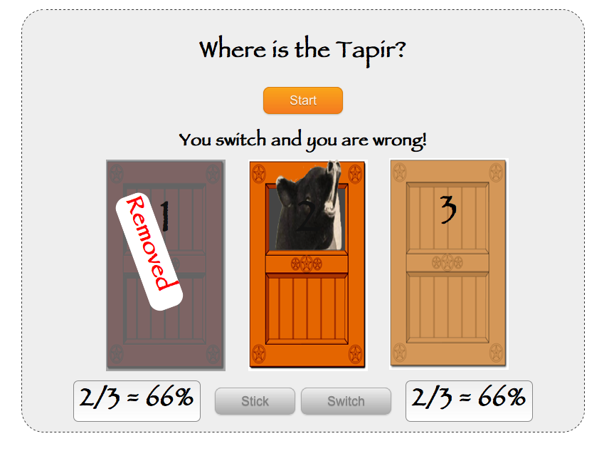

!SLIDE jquery
# putChoice
## json

    @@@ Javascript
    function putChoice(value) {
      $.ajax({
        ...
        success: function(data) {
          updateImage(data);
          infoResult(data);
          updateStats(data);
          resetButtons();
        }
      });
    }

!SLIDE jquery
# updateStats
## Javascript, text

    @@@ javascript
    function updateStat(data, kind) {
      var arr = data[kind];
      var correct = arr[0], guesses = arr[1];
      var percentage = 0;
      if (guesses > 0) {
        percentage =
          parseInt(correct / guesses * 100);
      }
      var text = correct + '/' + guesses
          + ' = ' + percentage + '%'
      $('#' + kind + '-count').text(text);
    }

!SLIDE center transition=scrollUp

!SLIDE jquery
# Initiate
## getJSON

    @@@javascript
    $.getJSON('/stats', function(data) {
      updateStats(data);
      resetButtons();
    });

    function updateStats(data) {
      updateStat(data, 'stick');
      updateStat(data, 'switch');
    }

