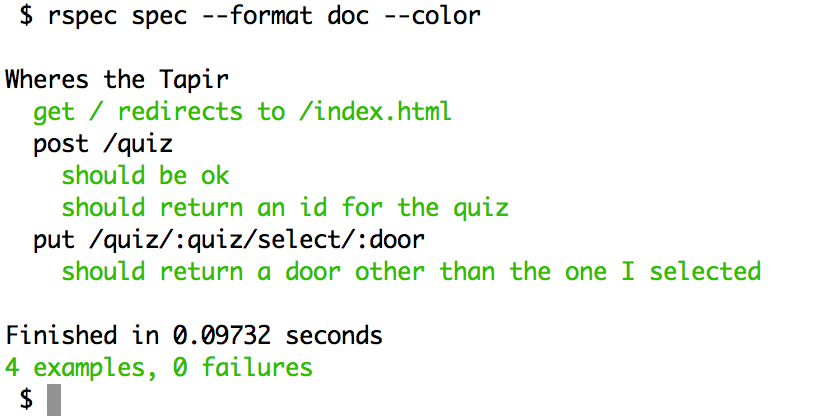
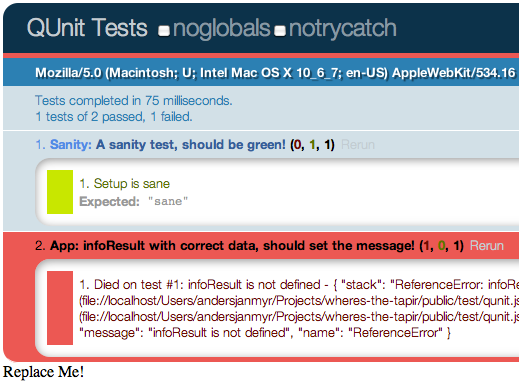

!SLIDE center
# Testing

!SLIDE 
# RSpec with Rack-Test
    @@@ruby
    describe 'Wheres the Tapir' do

      describe "post /quiz" do
        before :all do
          post '/quiz'
        end

        it 'should be ok' do
          last_response.should be_ok
        end

        it "should return an id for the quiz" do
          last_response.body.should match(/\d+/)
        end
      end
    end

!SLIDE center
# RSpec with Rack-Test

!SLIDE small
# QUnit

    @@@javascript
    $(function() {

      module("Sanity");
      test('A sanity test, should be green!', function() {
        same('sane', "sane", 'Setup is sane');
      });

      module('App#infoResult');
      test('correct, stick, should give correct text!', function() {
        infoResult({is_correct: true, choice: 'stick'});
        equal($('#info-message').text, 
            'You stick and you are right!');
      });

    });

!SLIDE center
# QUnit

